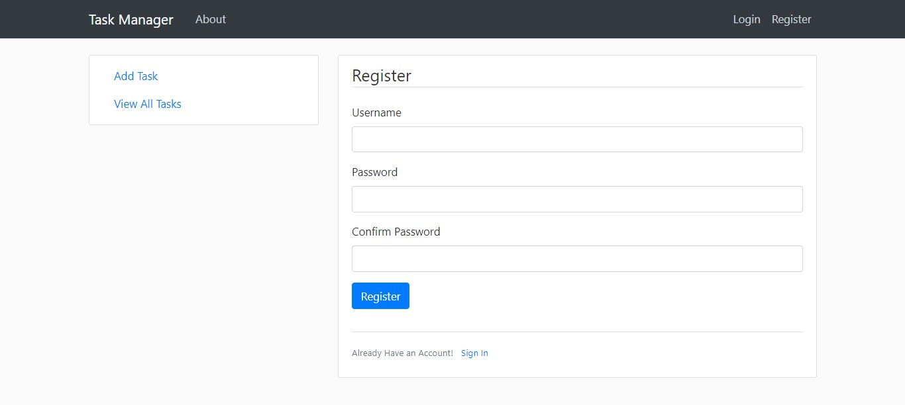
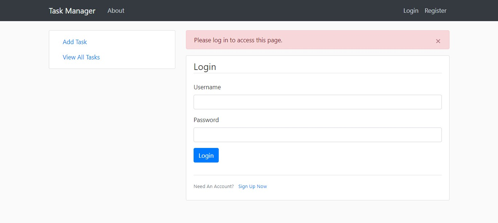
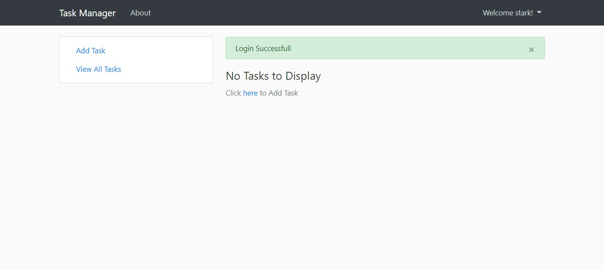
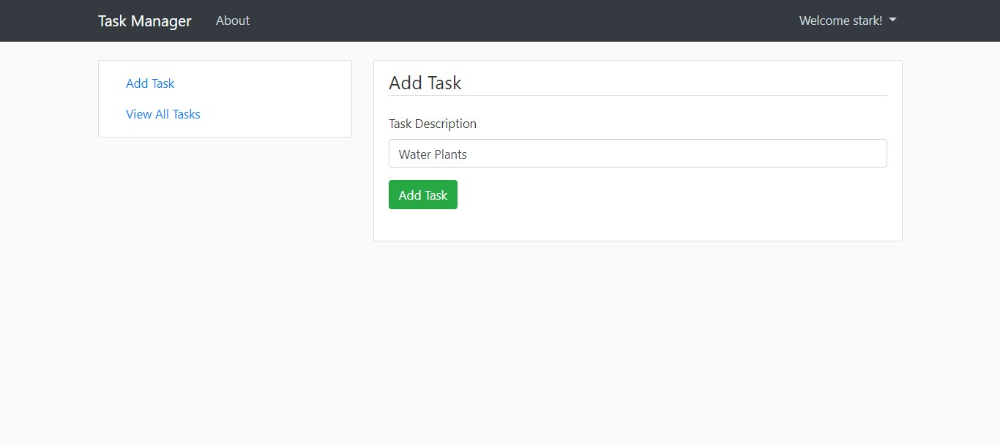
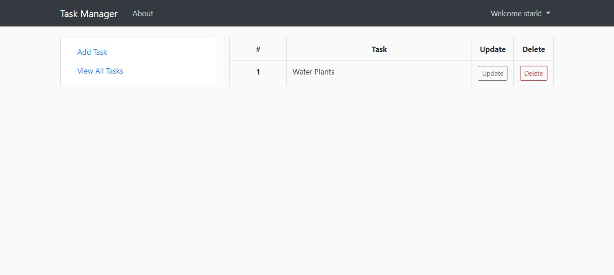
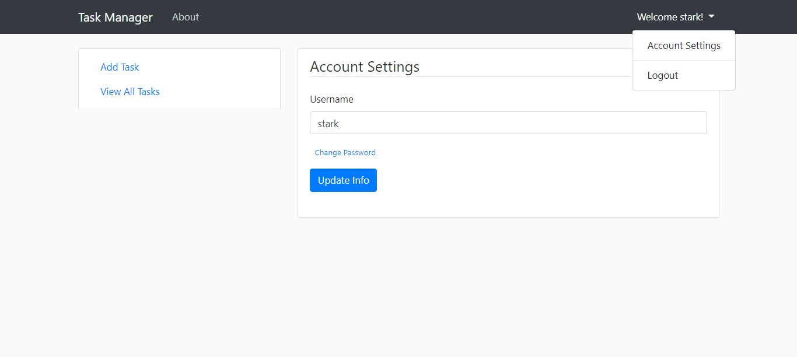

# 🛡️ Task Manager - DevSecOps Pipeline Showcase

A robust, containerized web application designed to demonstrate the practical implementation of a complete **DevSecOps CI/CD Pipeline**. 

Originally a simple Flask-based To-Do app, this project has been re-architected to integrate modern continuous integration, automated security testing (SAST/DAST), and post-deployment monitoring.

## 🚀 DevSecOps Architecture & Pipeline

This repository utilizes **GitHub Actions** to orchestrate a multi-stage automated pipeline that ensures code quality and infrastructure security before any deployment.

- **Containerization (Docker):** The application is fully containerized, ensuring an immutable, predictable, and environment-agnostic deployment.
- **Continuous Integration (CI):** Automated linting (`Flake8`) and unit testing (`Pytest`) trigger on every push to `main`, `development`, and `stage` branches.
- **Static Application Security Testing (SAST):**
  - **Bandit:** Automatically scans the Python source code for common security issues (e.g., hardcoded passwords, weak cryptography).
  - **Pip-Audit:** Scans the `requirements.txt` against the PyPI vulnerability database to prevent the usage of vulnerable dependencies.
- **Dynamic Application Security Testing (DAST):** 
  - **OWASP ZAP:** During the `Deploy Stage`, an ephemeral container of the OWASP ZAP scanner is provisioned to actively attack the running web application, checking for missing security headers, CSRF vulnerabilities, and XSS risks in runtime.
- **Continuous Monitoring:** The pipeline automatically provisions **Prometheus** and **Grafana** containers alongside the staging application to ensure active telemetry and health monitoring post-deployment.

## 🛠️ Technologies & Tools

* **Backend:** Python 3.9, Flask, SQLAlchemy
* **Infrastructure as Code:** Docker, Dockerfile
* **CI/CD:** GitHub Actions
* **Security:** Bandit, Pip-Audit, OWASP ZAP (zaproxy/zap-stable)
* **Monitoring:** Prometheus, Grafana
* **Testing:** Pytest

## 💻 Local Usage (Dockerized)

Since the application is fully containerized, you don't need to pollute your local machine with Python dependencies. You just need Docker installed.

1. **Clone the repository:**
```bash
   git clone [https://github.com/guidw/gestao-tarefas-devsecops.git](https://github.com/guidw/gestao-tarefas-devsecops.git)
   cd gestao-tarefas-devsecops

# Results

## Registration Page
Login or Register if you dont have an account



## Accessing URL's 
User cannot access any URL's if they are not logged in



## After Successfull Login
See all your tasks after successfull login.



## Add Tasks
Click the **Add Task** link in the side-bar to add tasks



## View All Tasks
Click the **View All Task** link in the side-bar to see all tasks. You can **Update** and **Delete** Tasks from this page.



## Account Settings
Change your username and password. You can access this by clicking dropdown in the Navbar



